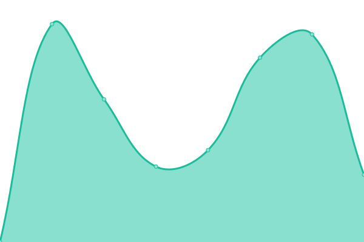
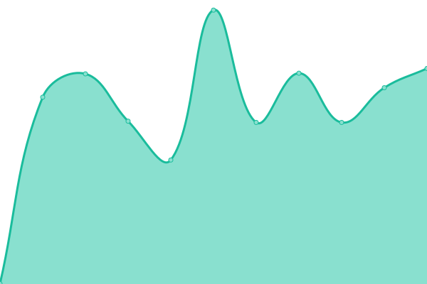
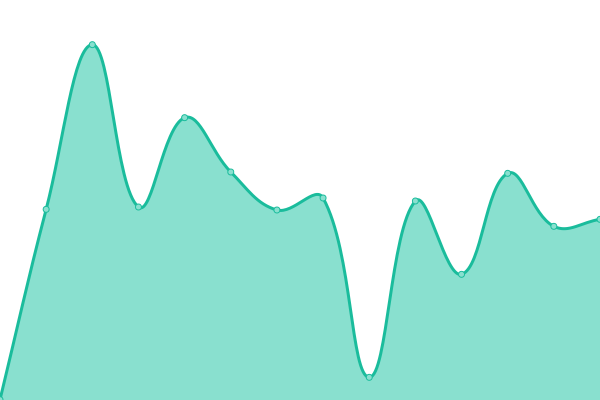
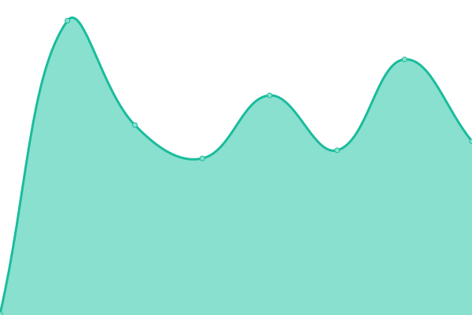
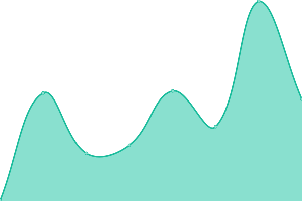
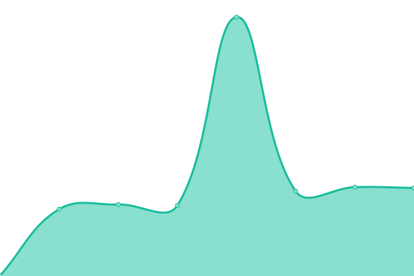

# [📈 Live Status](https://demo.upptime.js.org): <!--live status--> **🟧 Partial outage**

This repository contains the open-source uptime monitor and status page for [Arian Omrani](https://devdon.ir), powered by [Upptime](https://github.com/upptime/upptime).

With [Upptime](https://upptime.js.org), you can get your own unlimited and free uptime monitor and status page, powered entirely by a GitHub repository. We use [Issues](https://github.com/arian24b/utm/issues) as incident reports, [Actions](https://github.com/arian24b/utm/actions) as uptime monitors, and [Pages](https://demo.upptime.js.org) for the status page.

<!--start: status pages-->
<!-- This summary is generated by Upptime (https://github.com/upptime/upptime) -->
<!-- Do not edit this manually, your changes will be overwritten -->
<!-- prettier-ignore -->
| URL | Status | History | Response Time | Uptime |
| --- | ------ | ------- | ------------- | ------ |
|  [insightsite.info](https://insightsite.info) | 🟩 Up | [insightsite-info.yml](https://github.com/arian24b/utm/commits/HEAD/history/insightsite-info.yml) | 

 1082ms
     
 | 

<a href="https://utm.usite.tech/history/insightsite-info">100.00%</a>
    

|  [hezartoo.media](https://hezartoo.media) | 🟩 Up | [hezartoo-media.yml](https://github.com/arian24b/utm/commits/HEAD/history/hezartoo-media.yml) | 

 866ms
     
 | 

<a href="https://utm.usite.tech/history/hezartoo-media">99.88%</a>
    

|  [demo.insightsite.info](https://demo.insightsite.info) | 🟥 Down | [demo-insightsite-info.yml](https://github.com/arian24b/utm/commits/HEAD/history/demo-insightsite-info.yml) | 

 0ms
     
 | 

<a href="https://utm.usite.tech/history/demo-insightsite-info">0.00%</a>
    

|  [insightsite.ir](https://insightsite.ir) | 🟩 Up | [insightsite-ir.yml](https://github.com/arian24b/utm/commits/HEAD/history/insightsite-ir.yml) | 

 797ms
     
 | 

<a href="https://utm.usite.tech/history/insightsite-ir">100.00%</a>
    

|  [devdon.ir](https://devdon.ir) | 🟩 Up | [devdon-ir.yml](https://github.com/arian24b/utm/commits/HEAD/history/devdon-ir.yml) | 

 1579ms
     
 | 

<a href="https://utm.usite.tech/history/devdon-ir">100.00%</a>
    

|  [arianomrani.ir](https://arianomrani.ir) | 🟩 Up | [arianomrani-ir.yml](https://github.com/arian24b/utm/commits/HEAD/history/arianomrani-ir.yml) | 

 743ms
     
 | 

<a href="https://utm.usite.tech/history/arianomrani-ir">100.00%</a>
    

|  [v.usite.tech](https://v.usite.tech) | 🟥 Down | [v-usite-tech.yml](https://github.com/arian24b/utm/commits/HEAD/history/v-usite-tech.yml) | 

 797ms
     
 | 

<a href="https://utm.usite.tech/history/v-usite-tech">0.00%</a>
    

|  [cp.usite.tech](https://cp.usite.tech) | 🟥 Down | [cp-usite-tech.yml](https://github.com/arian24b/utm/commits/HEAD/history/cp-usite-tech.yml) | 

 0ms
     
 | 

<a href="https://utm.usite.tech/history/cp-usite-tech">0.00%</a>
    

|  [arianameson.ir](https://arianameson.ir) | 🟥 Down | [arianameson-ir.yml](https://github.com/arian24b/utm/commits/HEAD/history/arianameson-ir.yml) | 

 1253ms
     
 | 

<a href="https://utm.usite.tech/history/arianameson-ir">0.00%</a>
    

|  [s2dio.ir](https://s2dio.ir) | 🟩 Up | [s2dio-ir.yml](https://github.com/arian24b/utm/commits/HEAD/history/s2dio-ir.yml) | 

 345ms
     
 | 

<a href="https://utm.usite.tech/history/s2dio-ir">100.00%</a>
    

|  [ablmoasherati.ir](https://ablmoasherati.ir) | 🟥 Down | [ablmoasherati-ir.yml](https://github.com/arian24b/utm/commits/HEAD/history/ablmoasherati-ir.yml) | 

 942ms
     
 | 

<a href="https://utm.usite.tech/history/ablmoasherati-ir">0.00%</a>
    

|  [calendarix.pro](https://calendarix.pro) | 🟥 Down | [calendarix-pro.yml](https://github.com/arian24b/utm/commits/HEAD/history/calendarix-pro.yml) | 

 19761ms
     
 | 

<a href="https://utm.usite.tech/history/calendarix-pro">0.00%</a>
    

|  [api.calendarix.pro](https://api.calendarix.pro) | 🟥 Down | [api-calendarix-pro.yml](https://github.com/arian24b/utm/commits/HEAD/history/api-calendarix-pro.yml) | 

 19670ms
     
 | 

<a href="https://utm.usite.tech/history/api-calendarix-pro">0.00%</a>
    

|  [api.s2dio.ir](https://api.s2dio.ir) | 🟩 Up | [api-s2dio-ir.yml](https://github.com/arian24b/utm/commits/HEAD/history/api-s2dio-ir.yml) | 

 958ms
     
 | 

<a href="https://utm.usite.tech/history/api-s2dio-ir">100.00%</a>
    

|  [utm.usite.tech](https://utm.usite.tech) | 🟩 Up | [utm-usite-tech.yml](https://github.com/arian24b/utm/commits/HEAD/history/utm-usite-tech.yml) | 

 167ms
     
 | 

<a href="https://utm.usite.tech/history/utm-usite-tech">100.00%</a>
    

|  [soha](soha.usite.tech) | 🟩 Up | [soha.yml](https://github.com/arian24b/utm/commits/HEAD/history/soha.yml) | 

 150ms
     
 | 

<a href="https://utm.usite.tech/history/soha">100.00%</a>
    

|  [mahsa](mahsa.usite.tech) | 🟥 Down | [mahsa.yml](https://github.com/arian24b/utm/commits/HEAD/history/mahsa.yml) | 

 0ms
     
 | 

<a href="https://utm.usite.tech/history/mahsa">0.00%</a>
    

|  [dl.devdon.ir](https://dl.devdon.ir) | 🟥 Down | [dl-devdon-ir.yml](https://github.com/arian24b/utm/commits/HEAD/history/dl-devdon-ir.yml) | 

 1226ms
     
 | 

<a href="https://utm.usite.tech/history/dl-devdon-ir">0.00%</a>
    

<!--end: status pages-->

[**Visit our status website →**](https://demo.upptime.js.org)

## 📄 License

- Powered by: [Upptime](https://github.com/upptime/upptime)
- Code: [MIT](./LICENSE) © [Anand Chowdhary](https://anandchowdhary.com), supported by [Pabio](https://pabio.com)
- Data in the `./history` directory: [Open Database License](https://opendatacommons.org/licenses/odbl/1-0/)
