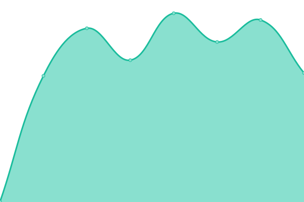
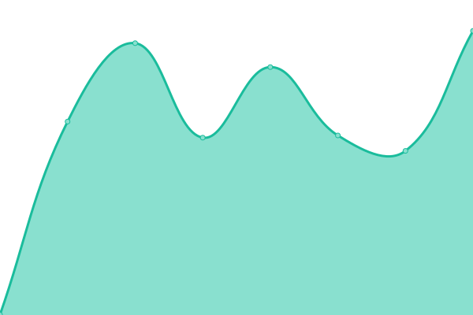
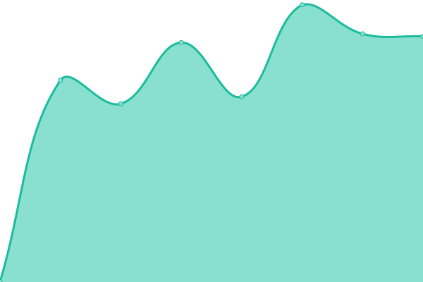
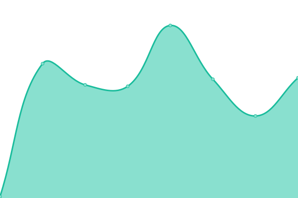
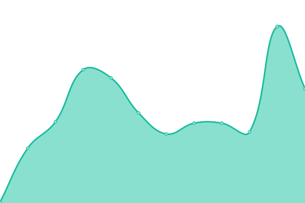
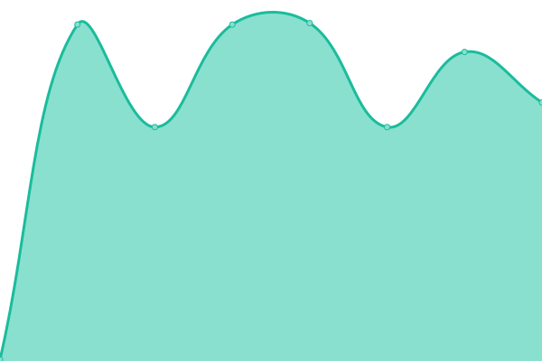
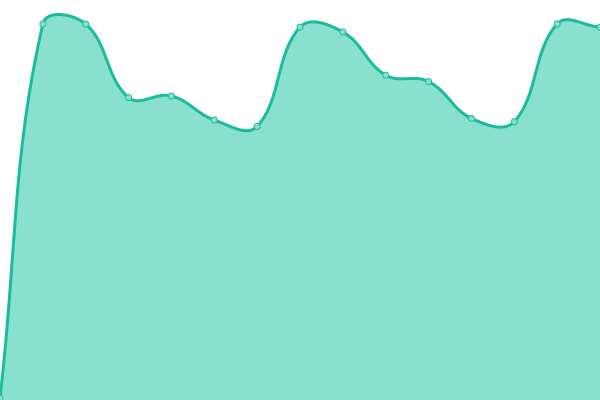

# [📈 Live Status](https://demo.upptime.js.org): <!--live status--> **🟧 Partial outage**

This repository contains the open-source uptime monitor and status page for [Arian Omrani](https://devdon.ir), powered by [Upptime](https://github.com/upptime/upptime).

With [Upptime](https://upptime.js.org), you can get your own unlimited and free uptime monitor and status page, powered entirely by a GitHub repository. We use [Issues](https://github.com/arian24b/utm/issues) as incident reports, [Actions](https://github.com/arian24b/utm/actions) as uptime monitors, and [Pages](https://demo.upptime.js.org) for the status page.

<!--start: status pages-->
<!-- This summary is generated by Upptime (https://github.com/upptime/upptime) -->
<!-- Do not edit this manually, your changes will be overwritten -->
<!-- prettier-ignore -->
| URL | Status | History | Response Time | Uptime |
| --- | ------ | ------- | ------------- | ------ |
|  [devdon.ir](https://devdon.ir) | 🟥 Down | [devdon-ir.yml](https://github.com/arian24b/utm/commits/HEAD/history/devdon-ir.yml) | 

 266ms
     
 | 

<a href="https://utm.udns.site/history/devdon-ir">0.00%</a>
    

|  [arianomrani.ir](https://arianomrani.ir) | 🟥 Down | [arianomrani-ir.yml](https://github.com/arian24b/utm/commits/HEAD/history/arianomrani-ir.yml) | 

 265ms
     
 | 

<a href="https://utm.udns.site/history/arianomrani-ir">0.00%</a>
    

|  [v.udns.site](https://v.udns.site) | 🟩 Up | [v-udns-site.yml](https://github.com/arian24b/utm/commits/HEAD/history/v-udns-site.yml) | 

 622ms
     
 | 

<a href="https://utm.udns.site/history/v-udns-site">100.00%</a>
    

|  [msn.udns.site](https://msn.udns.site) | 🟩 Up | [msn-udns-site.yml](https://github.com/arian24b/utm/commits/HEAD/history/msn-udns-site.yml) | 

 628ms
     
 | 

<a href="https://utm.udns.site/history/msn-udns-site">100.00%</a>
    

|  [cp.udns.site](https://cp.udns.site) | 🟩 Up | [cp-udns-site.yml](https://github.com/arian24b/utm/commits/HEAD/history/cp-udns-site.yml) | 

 771ms
     
 | 

<a href="https://utm.udns.site/history/cp-udns-site">100.00%</a>
    

|  [arianameson.ir](https://arianameson.ir) | 🟥 Down | [arianameson-ir.yml](https://github.com/arian24b/utm/commits/HEAD/history/arianameson-ir.yml) | 

 0ms
     
 | 

<a href="https://utm.udns.site/history/arianameson-ir">0.00%</a>
    

|  [v.cloud-game.site](https://v.cloud-game.site) | 🟥 Down | [v-cloud-game-site.yml](https://github.com/arian24b/utm/commits/HEAD/history/v-cloud-game-site.yml) | 

 516ms
     
 | 

<a href="https://utm.udns.site/history/v-cloud-game-site">99.97%</a>
    

|  [utm.udns.site](https://utm.udns.site) | 🟩 Up | [utm-udns-site.yml](https://github.com/arian24b/utm/commits/HEAD/history/utm-udns-site.yml) | 

 149ms
     
 | 

<a href="https://utm.udns.site/history/utm-udns-site">100.00%</a>
    

|  [soha](soha.udns.site) | 🟩 Up | [soha.yml](https://github.com/arian24b/utm/commits/HEAD/history/soha.yml) | 

 131ms
     
 | 

<a href="https://utm.udns.site/history/soha">100.00%</a>
    

|  [aida](aida.udns.site) | 🟩 Up | [aida.yml](https://github.com/arian24b/utm/commits/HEAD/history/aida.yml) | 

 182ms
     
 | 

<a href="https://utm.udns.site/history/aida">100.00%</a>
    

|  [servern2](servern2.udns.site) | 🟩 Up | [servern2.yml](https://github.com/arian24b/utm/commits/HEAD/history/servern2.yml) | 

 111ms
     
 | 

<a href="https://utm.udns.site/history/servern2">100.00%</a>
    

|  [servern4](servern4.udns.site) | 🟥 Down | [servern4.yml](https://github.com/arian24b/utm/commits/HEAD/history/servern4.yml) | 

 0ms
     
 | 

<a href="https://utm.udns.site/history/servern4">0.00%</a>
    

|  [kane](kane.cloud-game.site) | 🟥 Down | [kane.yml](https://github.com/arian24b/utm/commits/HEAD/history/kane.yml) | 

 131ms
     
 | 

<a href="https://utm.udns.site/history/kane">100.00%</a>
    

|  [milly](milly.cloud-game.site) | 🟩 Up | [milly.yml](https://github.com/arian24b/utm/commits/HEAD/history/milly.yml) | 

 215ms
     
 | 

<a href="https://utm.udns.site/history/milly">100.00%</a>
    

<!--end: status pages-->

[**Visit our status website →**](https://demo.upptime.js.org)

## 📄 License

- Powered by: [Upptime](https://github.com/upptime/upptime)
- Code: [MIT](./LICENSE) © [Anand Chowdhary](https://anandchowdhary.com), supported by [Pabio](https://pabio.com)
- Data in the `./history` directory: [Open Database License](https://opendatacommons.org/licenses/odbl/1-0/)
