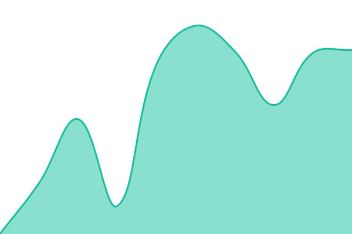
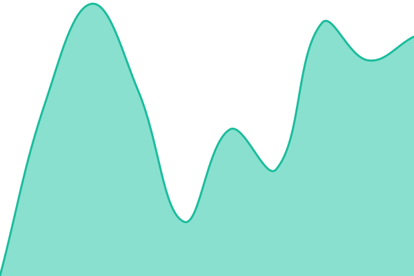
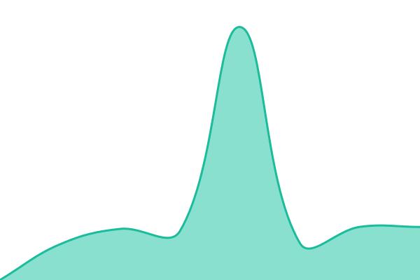
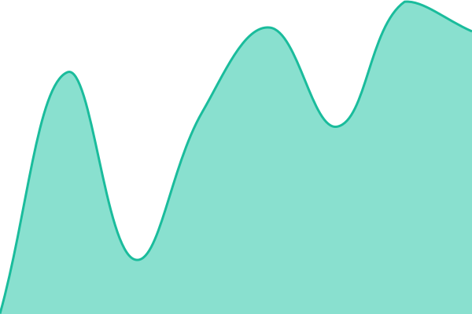

# [📈 Live Status](https://demo.upptime.js.org): <!--live status--> **🟧 Partial outage**

This repository contains the open-source uptime monitor and status page for [Arian Omrani](https://devdon.ir), powered by [Upptime](https://github.com/upptime/upptime).

With [Upptime](https://upptime.js.org), you can get your own unlimited and free uptime monitor and status page, powered entirely by a GitHub repository. We use [Issues](https://github.com/arian24b/utm/issues) as incident reports, [Actions](https://github.com/arian24b/utm/actions) as uptime monitors, and [Pages](https://demo.upptime.js.org) for the status page.

<!--start: status pages-->
<!-- This summary is generated by Upptime (https://github.com/upptime/upptime) -->
<!-- Do not edit this manually, your changes will be overwritten -->
<!-- prettier-ignore -->
| URL | Status | History | Response Time | Uptime |
| --- | ------ | ------- | ------------- | ------ |
|  [arianomrani.ir](https://arianomrani.ir) | 🟩 Up | [arianomrani-ir.yml](https://github.com/arian24b/utm/commits/HEAD/history/arianomrani-ir.yml) | 

 4602ms
     
 | 

<a href="https://utm.s2dio.ir/history/arianomrani-ir">98.24%</a>
    

|  [devdon.ir](https://devdon.ir) | 🟩 Up | [devdon-ir.yml](https://github.com/arian24b/utm/commits/HEAD/history/devdon-ir.yml) | 

 4310ms
     
 | 

<a href="https://utm.s2dio.ir/history/devdon-ir">98.26%</a>
    

|  [dl.devdon.ir](https://dl.devdon.ir) | 🟥 Down | [dl-devdon-ir.yml](https://github.com/arian24b/utm/commits/HEAD/history/dl-devdon-ir.yml) | 

 37ms
     
 | 

<a href="https://utm.s2dio.ir/history/dl-devdon-ir">0.00%</a>
    

|  [isgood.site](https://isgood.site) | 🟥 Down | [isgood-site.yml](https://github.com/arian24b/utm/commits/HEAD/history/isgood-site.yml) | 

 0ms
     
 | 

<a href="https://utm.s2dio.ir/history/isgood-site">0.00%</a>
    

|  [a.isgood.site](https://a.isgood.site) | 🟥 Down | [a-isgood-site.yml](https://github.com/arian24b/utm/commits/HEAD/history/a-isgood-site.yml) | 

 0ms
     
 | 

<a href="https://utm.s2dio.ir/history/a-isgood-site">0.00%</a>
    

|  [v.isgood.site](https://v.isgood.site) | 🟩 Up | [v-isgood-site.yml](https://github.com/arian24b/utm/commits/HEAD/history/v-isgood-site.yml) | 

 1212ms
     
 | 

<a href="https://utm.s2dio.ir/history/v-isgood-site">100.00%</a>
    

|  [s2dio.ir](https://s2dio.ir) | 🟩 Up | [s2dio-ir.yml](https://github.com/arian24b/utm/commits/HEAD/history/s2dio-ir.yml) | 

 4399ms
     
 | 

<a href="https://utm.s2dio.ir/history/s2dio-ir">98.28%</a>
    

|  [soha.s2dio.ir](https://soha.s2dio.ir) | 🟥 Down | [soha-s2dio-ir.yml](https://github.com/arian24b/utm/commits/HEAD/history/soha-s2dio-ir.yml) | 

 462ms
     
 | 

<a href="https://utm.s2dio.ir/history/soha-s2dio-ir">0.00%</a>
    

|  [api.s2dio.ir](https://api.s2dio.ir) | 🟩 Up | [api-s2dio-ir.yml](https://github.com/arian24b/utm/commits/HEAD/history/api-s2dio-ir.yml) | 

 17118ms
     
 | 

<a href="https://utm.s2dio.ir/history/api-s2dio-ir">43.16%</a>
    

|  [dash.s2dio.ir](https://dash.s2dio.ir) | 🟩 Up | [dash-s2dio-ir.yml](https://github.com/arian24b/utm/commits/HEAD/history/dash-s2dio-ir.yml) | 

 929ms
     
 | 

<a href="https://utm.s2dio.ir/history/dash-s2dio-ir">100.00%</a>
    

|  [dl.s2dio.ir](https://dl.s2dio.ir) | 🟥 Down | [dl-s2dio-ir.yml](https://github.com/arian24b/utm/commits/HEAD/history/dl-s2dio-ir.yml) | 

 550ms
     
 | 

<a href="https://utm.s2dio.ir/history/dl-s2dio-ir">0.00%</a>
    

|  [net.s2dio.ir](https://net.s2dio.ir) | 🟩 Up | [net-s2dio-ir.yml](https://github.com/arian24b/utm/commits/HEAD/history/net-s2dio-ir.yml) | 

 859ms
     
 | 

<a href="https://utm.s2dio.ir/history/net-s2dio-ir">100.00%</a>
    

|  [server.s2dio.ir](https://server.s2dio.ir) | 🟩 Up | [server-s2dio-ir.yml](https://github.com/arian24b/utm/commits/HEAD/history/server-s2dio-ir.yml) | 

 978ms
     
 | 

<a href="https://utm.s2dio.ir/history/server-s2dio-ir">100.00%</a>
    

|  [v.s2dio.ir](https://v.s2dio.ir) | 🟥 Down | [v-s2dio-ir.yml](https://github.com/arian24b/utm/commits/HEAD/history/v-s2dio-ir.yml) | 

 698ms
     
 | 

<a href="https://utm.s2dio.ir/history/v-s2dio-ir">0.00%</a>
    

<!--end: status pages-->

[**Visit our status website →**](https://demo.upptime.js.org)

## 📄 License

- Powered by: [Upptime](https://github.com/upptime/upptime)
- Code: [MIT](./LICENSE) © [Anand Chowdhary](https://anandchowdhary.com), supported by [Pabio](https://pabio.com)
- Data in the `./history` directory: [Open Database License](https://opendatacommons.org/licenses/odbl/1-0/)
