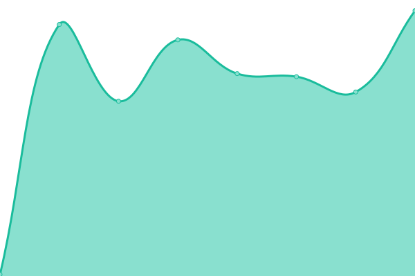

# [📈 Live Status](https://demo.upptime.js.org): <!--live status--> **🟧 Partial outage**

This repository contains the open-source uptime monitor and status page for [Arian Omrani](https://devdon.ir), powered by [Upptime](https://github.com/upptime/upptime).

With [Upptime](https://upptime.js.org), you can get your own unlimited and free uptime monitor and status page, powered entirely by a GitHub repository. We use [Issues](https://github.com/arian24b/utm/issues) as incident reports, [Actions](https://github.com/arian24b/utm/actions) as uptime monitors, and [Pages](https://demo.upptime.js.org) for the status page.

<!--start: status pages-->
<!-- This summary is generated by Upptime (https://github.com/upptime/upptime) -->
<!-- Do not edit this manually, your changes will be overwritten -->
<!-- prettier-ignore -->
| URL | Status | History | Response Time | Uptime |
| --- | ------ | ------- | ------------- | ------ |
|  [devdon.ir](https://devdon.ir) | 🟥 Down | [devdon-ir.yml](https://github.com/arian24b/utm/commits/HEAD/history/devdon-ir.yml) | 

 272ms
     
 | 

<a href="https://utm.udns.site/history/devdon-ir">0.00%</a>
    

|  [arianomrani.ir](https://arianomrani.ir) | 🟥 Down | [arianomrani-ir.yml](https://github.com/arian24b/utm/commits/HEAD/history/arianomrani-ir.yml) | 

 334ms
     
 | 

<a href="https://utm.udns.site/history/arianomrani-ir">0.00%</a>
    

|  [v](https://v.udns.site) | 🟩 Up | [v.yml](https://github.com/arian24b/utm/commits/HEAD/history/v.yml) | 

 867ms
     
 | 

<a href="https://utm.udns.site/history/v">100.00%</a>
    

|  [cp](https://cp.udns.site) | 🟩 Up | [cp.yml](https://github.com/arian24b/utm/commits/HEAD/history/cp.yml) | 

 834ms
     
 | 

<a href="https://utm.udns.site/history/cp">100.00%</a>
    

|  [arianameson.ir](https://arianameson.ir) | 🟩 Up | [arianameson-ir.yml](https://github.com/arian24b/utm/commits/HEAD/history/arianameson-ir.yml) | 

 1107ms
     
 | 

<a href="https://utm.udns.site/history/arianameson-ir">100.00%</a>
    

|  [soha](soha.udns.site) | 🟩 Up | [soha.yml](https://github.com/arian24b/utm/commits/HEAD/history/soha.yml) | 

 187ms
     
 | 

<a href="https://utm.udns.site/history/soha">100.00%</a>
    

|  [aida](aida.udns.site) | 🟩 Up | [aida.yml](https://github.com/arian24b/utm/commits/HEAD/history/aida.yml) | 

 211ms
     
 | 

<a href="https://utm.udns.site/history/aida">100.00%</a>
    

<!--end: status pages-->

[**Visit our status website →**](https://demo.upptime.js.org)

## 📄 License

- Powered by: [Upptime](https://github.com/upptime/upptime)
- Code: [MIT](./LICENSE) © [Anand Chowdhary](https://anandchowdhary.com), supported by [Pabio](https://pabio.com)
- Data in the `./history` directory: [Open Database License](https://opendatacommons.org/licenses/odbl/1-0/)
