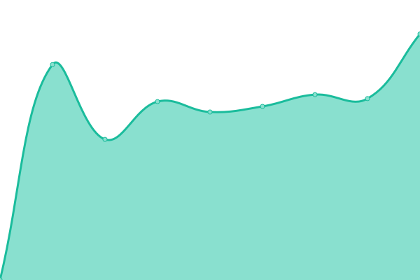

# [📈 Live Status](https://demo.upptime.js.org): <!--live status--> **🟧 Partial outage**

This repository contains the open-source uptime monitor and status page for [Arian Omrani](https://devdon.ir), powered by [Upptime](https://github.com/upptime/upptime).

With [Upptime](https://upptime.js.org), you can get your own unlimited and free uptime monitor and status page, powered entirely by a GitHub repository. We use [Issues](https://github.com/arian24b/utm/issues) as incident reports, [Actions](https://github.com/arian24b/utm/actions) as uptime monitors, and [Pages](https://demo.upptime.js.org) for the status page.

<!--start: status pages-->
<!-- This summary is generated by Upptime (https://github.com/upptime/upptime) -->
<!-- Do not edit this manually, your changes will be overwritten -->
<!-- prettier-ignore -->
| URL | Status | History | Response Time | Uptime |
| --- | ------ | ------- | ------------- | ------ |
|  [ablmoasherati.ir](https://ablmoasherati.ir) | 🟥 Down | [ablmoasherati-ir.yml](https://github.com/arian24b/utm/commits/HEAD/history/ablmoasherati-ir.yml) | 

 413ms
     
 | 

<a href="https://utm.s2dio.ir/history/ablmoasherati-ir">0.00%</a>
    

|  [www.ablmoasherati.ir](https://www.ablmoasherati.ir) | 🟥 Down | [www-ablmoasherati-ir.yml](https://github.com/arian24b/utm/commits/HEAD/history/www-ablmoasherati-ir.yml) | 

 386ms
     
 | 

<a href="https://utm.s2dio.ir/history/www-ablmoasherati-ir">0.00%</a>
    

|  [ar14n24b.ir](https://ar14n24b.ir) | 🟥 Down | [ar14n24b-ir.yml](https://github.com/arian24b/utm/commits/HEAD/history/ar14n24b-ir.yml) | 

 0ms
     
 | 

<a href="https://utm.s2dio.ir/history/ar14n24b-ir">0.00%</a>
    

|  [arian24b.ir](https://arian24b.ir) | 🟥 Down | [arian24b-ir.yml](https://github.com/arian24b/utm/commits/HEAD/history/arian24b-ir.yml) | 

 0ms
     
 | 

<a href="https://utm.s2dio.ir/history/arian24b-ir">0.00%</a>
    

|  [arianameson.ir](https://arianameson.ir) | 🟥 Down | [arianameson-ir.yml](https://github.com/arian24b/utm/commits/HEAD/history/arianameson-ir.yml) | 

 453ms
     
 | 

<a href="https://utm.s2dio.ir/history/arianameson-ir">0.00%</a>
    

|  [www.arianameson.ir](https://www.arianameson.ir) | 🟥 Down | [www-arianameson-ir.yml](https://github.com/arian24b/utm/commits/HEAD/history/www-arianameson-ir.yml) | 

 405ms
     
 | 

<a href="https://utm.s2dio.ir/history/www-arianameson-ir">0.00%</a>
    

|  [ariandev.ir](https://ariandev.ir) | 🟥 Down | [ariandev-ir.yml](https://github.com/arian24b/utm/commits/HEAD/history/ariandev-ir.yml) | 

 0ms
     
 | 

<a href="https://utm.s2dio.ir/history/ariandev-ir">0.00%</a>
    

|  [www.ariandev.ir](https://www.ariandev.ir) | 🟥 Down | [www-ariandev-ir.yml](https://github.com/arian24b/utm/commits/HEAD/history/www-ariandev-ir.yml) | 

 0ms
     
 | 

<a href="https://utm.s2dio.ir/history/www-ariandev-ir">0.00%</a>
    

|  [mail.ariandev.ir](https://mail.ariandev.ir) | 🟥 Down | [mail-ariandev-ir.yml](https://github.com/arian24b/utm/commits/HEAD/history/mail-ariandev-ir.yml) | 

 0ms
     
 | 

<a href="https://utm.s2dio.ir/history/mail-ariandev-ir">0.00%</a>
    

|  [arianomrani.ir](https://arianomrani.ir) | 🟩 Up | [arianomrani-ir.yml](https://github.com/arian24b/utm/commits/HEAD/history/arianomrani-ir.yml) | 

 1269ms
     
 | 

<a href="https://utm.s2dio.ir/history/arianomrani-ir">100.00%</a>
    

|  [beconnect.ir](https://beconnect.ir) | 🟥 Down | [beconnect-ir.yml](https://github.com/arian24b/utm/commits/HEAD/history/beconnect-ir.yml) | 

 0ms
     
 | 

<a href="https://utm.s2dio.ir/history/beconnect-ir">0.00%</a>
    

|  [devdon.ir](https://devdon.ir) | 🟩 Up | [devdon-ir.yml](https://github.com/arian24b/utm/commits/HEAD/history/devdon-ir.yml) | 

 663ms
     
 | 

<a href="https://utm.s2dio.ir/history/devdon-ir">100.00%</a>
    

|  [dl.devdon.ir](https://dl.devdon.ir) | 🟥 Down | [dl-devdon-ir.yml](https://github.com/arian24b/utm/commits/HEAD/history/dl-devdon-ir.yml) | 

 344ms
     
 | 

<a href="https://utm.s2dio.ir/history/dl-devdon-ir">0.00%</a>
    

|  [getinfra.ir](https://getinfra.ir) | 🟥 Down | [getinfra-ir.yml](https://github.com/arian24b/utm/commits/HEAD/history/getinfra-ir.yml) | 

 852ms
     
 | 

<a href="https://utm.s2dio.ir/history/getinfra-ir">0.00%</a>
    

|  [admin.getinfra.ir](https://admin.getinfra.ir) | 🟥 Down | [admin-getinfra-ir.yml](https://github.com/arian24b/utm/commits/HEAD/history/admin-getinfra-ir.yml) | 

 844ms
     
 | 

<a href="https://utm.s2dio.ir/history/admin-getinfra-ir">0.00%</a>
    

|  [panel.getinfra.ir](https://panel.getinfra.ir) | 🟥 Down | [panel-getinfra-ir.yml](https://github.com/arian24b/utm/commits/HEAD/history/panel-getinfra-ir.yml) | 

 848ms
     
 | 

<a href="https://utm.s2dio.ir/history/panel-getinfra-ir">0.00%</a>
    

|  [getmirror.ir](https://getmirror.ir) | 🟥 Down | [getmirror-ir.yml](https://github.com/arian24b/utm/commits/HEAD/history/getmirror-ir.yml) | 

 0ms
     
 | 

<a href="https://utm.s2dio.ir/history/getmirror-ir">0.00%</a>
    

|  [hamgym.ir](https://hamgym.ir) | 🟥 Down | [hamgym-ir.yml](https://github.com/arian24b/utm/commits/HEAD/history/hamgym-ir.yml) | 

 0ms
     
 | 

<a href="https://utm.s2dio.ir/history/hamgym-ir">0.00%</a>
    

|  [insightsite.info](https://insightsite.info) | 🟩 Up | [insightsite-info.yml](https://github.com/arian24b/utm/commits/HEAD/history/insightsite-info.yml) | 

 1138ms
     
 | 

<a href="https://utm.s2dio.ir/history/insightsite-info">100.00%</a>
    

|  [imap.insightsite.info](https://imap.insightsite.info) | 🟥 Down | [imap-insightsite-info.yml](https://github.com/arian24b/utm/commits/HEAD/history/imap-insightsite-info.yml) | 

 0ms
     
 | 

<a href="https://utm.s2dio.ir/history/imap-insightsite-info">0.00%</a>
    

|  [keila.insightsite.info](https://keila.insightsite.info) | 🟥 Down | [keila-insightsite-info.yml](https://github.com/arian24b/utm/commits/HEAD/history/keila-insightsite-info.yml) | 

 802ms
     
 | 

<a href="https://utm.s2dio.ir/history/keila-insightsite-info">0.00%</a>
    

|  [pop3.insightsite.info](https://pop3.insightsite.info) | 🟥 Down | [pop3-insightsite-info.yml](https://github.com/arian24b/utm/commits/HEAD/history/pop3-insightsite-info.yml) | 

 0ms
     
 | 

<a href="https://utm.s2dio.ir/history/pop3-insightsite-info">0.00%</a>
    

|  [smtp.insightsite.info](https://smtp.insightsite.info) | 🟥 Down | [smtp-insightsite-info.yml](https://github.com/arian24b/utm/commits/HEAD/history/smtp-insightsite-info.yml) | 

 0ms
     
 | 

<a href="https://utm.s2dio.ir/history/smtp-insightsite-info">0.00%</a>
    

|  [insightsite.ir](https://insightsite.ir) | 🟩 Up | [insightsite-ir.yml](https://github.com/arian24b/utm/commits/HEAD/history/insightsite-ir.yml) | 

 717ms
     
 | 

<a href="https://utm.s2dio.ir/history/insightsite-ir">100.00%</a>
    

|  [isgood.site](https://isgood.site) | 🟥 Down | [isgood-site.yml](https://github.com/arian24b/utm/commits/HEAD/history/isgood-site.yml) | 

 0ms
     
 | 

<a href="https://utm.s2dio.ir/history/isgood-site">0.00%</a>
    

|  [a.isgood.site](https://a.isgood.site) | 🟥 Down | [a-isgood-site.yml](https://github.com/arian24b/utm/commits/HEAD/history/a-isgood-site.yml) | 

 0ms
     
 | 

<a href="https://utm.s2dio.ir/history/a-isgood-site">0.00%</a>
    

|  [v.isgood.site](https://v.isgood.site) | 🟩 Up | [v-isgood-site.yml](https://github.com/arian24b/utm/commits/HEAD/history/v-isgood-site.yml) | 

 1117ms
     
 | 

<a href="https://utm.s2dio.ir/history/v-isgood-site">0.00%</a>
    

|  [lambd.ir](https://lambd.ir) | 🟥 Down | [lambd-ir.yml](https://github.com/arian24b/utm/commits/HEAD/history/lambd-ir.yml) | 

 0ms
     
 | 

<a href="https://utm.s2dio.ir/history/lambd-ir">0.00%</a>
    

|  [ourgym.ir](https://ourgym.ir) | 🟥 Down | [ourgym-ir.yml](https://github.com/arian24b/utm/commits/HEAD/history/ourgym-ir.yml) | 

 0ms
     
 | 

<a href="https://utm.s2dio.ir/history/ourgym-ir">0.00%</a>
    

|  [s2dio.ir](https://s2dio.ir) | 🟩 Up | [s2dio-ir.yml](https://github.com/arian24b/utm/commits/HEAD/history/s2dio-ir.yml) | 

 704ms
     
 | 

<a href="https://utm.s2dio.ir/history/s2dio-ir">100.00%</a>
    

|  [soha.s2dio.ir](https://soha.s2dio.ir) | 🟥 Down | [soha-s2dio-ir.yml](https://github.com/arian24b/utm/commits/HEAD/history/soha-s2dio-ir.yml) | 

 0ms
     
 | 

<a href="https://utm.s2dio.ir/history/soha-s2dio-ir">0.00%</a>
    

|  [api-billing-lago.s2dio.ir](https://api-billing-lago.s2dio.ir) | 🟥 Down | [api-billing-lago-s2dio-ir.yml](https://github.com/arian24b/utm/commits/HEAD/history/api-billing-lago-s2dio-ir.yml) | 

 853ms
     
 | 

<a href="https://utm.s2dio.ir/history/api-billing-lago-s2dio-ir">0.00%</a>
    

|  [api.s2dio.ir](https://api.s2dio.ir) | 🟩 Up | [api-s2dio-ir.yml](https://github.com/arian24b/utm/commits/HEAD/history/api-s2dio-ir.yml) | 

 896ms
     
 | 

<a href="https://utm.s2dio.ir/history/api-s2dio-ir">0.00%</a>
    

|  [backup.s2dio.ir](https://backup.s2dio.ir) | 🟥 Down | [backup-s2dio-ir.yml](https://github.com/arian24b/utm/commits/HEAD/history/backup-s2dio-ir.yml) | 

 813ms
     
 | 

<a href="https://utm.s2dio.ir/history/backup-s2dio-ir">0.00%</a>
    

|  [billing-lago.s2dio.ir](https://billing-lago.s2dio.ir) | 🟥 Down | [billing-lago-s2dio-ir.yml](https://github.com/arian24b/utm/commits/HEAD/history/billing-lago-s2dio-ir.yml) | 

 830ms
     
 | 

<a href="https://utm.s2dio.ir/history/billing-lago-s2dio-ir">0.00%</a>
    

|  [dash.s2dio.ir](https://dash.s2dio.ir) | 🟩 Up | [dash-s2dio-ir.yml](https://github.com/arian24b/utm/commits/HEAD/history/dash-s2dio-ir.yml) | 

 907ms
     
 | 

<a href="https://utm.s2dio.ir/history/dash-s2dio-ir">100.00%</a>
    

|  [dl.s2dio.ir](https://dl.s2dio.ir) | 🟥 Down | [dl-s2dio-ir.yml](https://github.com/arian24b/utm/commits/HEAD/history/dl-s2dio-ir.yml) | 

 836ms
     
 | 

<a href="https://utm.s2dio.ir/history/dl-s2dio-ir">0.00%</a>
    

|  [edge.s2dio.ir](https://edge.s2dio.ir) | 🟥 Down | [edge-s2dio-ir.yml](https://github.com/arian24b/utm/commits/HEAD/history/edge-s2dio-ir.yml) | 

 818ms
     
 | 

<a href="https://utm.s2dio.ir/history/edge-s2dio-ir">0.00%</a>
    

|  [financialfreedom.s2dio.ir](https://financialfreedom.s2dio.ir) | 🟥 Down | [financialfreedom-s2dio-ir.yml](https://github.com/arian24b/utm/commits/HEAD/history/financialfreedom-s2dio-ir.yml) | 

 728ms
     
 | 

<a href="https://utm.s2dio.ir/history/financialfreedom-s2dio-ir">0.00%</a>
    

|  [gitsave.s2dio.ir](https://gitsave.s2dio.ir) | 🟥 Down | [gitsave-s2dio-ir.yml](https://github.com/arian24b/utm/commits/HEAD/history/gitsave-s2dio-ir.yml) | 

 779ms
     
 | 

<a href="https://utm.s2dio.ir/history/gitsave-s2dio-ir">0.00%</a>
    

|  [moni.s2dio.ir](https://moni.s2dio.ir) | 🟥 Down | [moni-s2dio-ir.yml](https://github.com/arian24b/utm/commits/HEAD/history/moni-s2dio-ir.yml) | 

 742ms
     
 | 

<a href="https://utm.s2dio.ir/history/moni-s2dio-ir">0.00%</a>
    

|  [net.s2dio.ir](https://net.s2dio.ir) | 🟩 Up | [net-s2dio-ir.yml](https://github.com/arian24b/utm/commits/HEAD/history/net-s2dio-ir.yml) | 

 725ms
     
 | 

<a href="https://utm.s2dio.ir/history/net-s2dio-ir">100.00%</a>
    

|  [pocketbase.s2dio.ir](https://pocketbase.s2dio.ir) | 🟥 Down | [pocketbase-s2dio-ir.yml](https://github.com/arian24b/utm/commits/HEAD/history/pocketbase-s2dio-ir.yml) | 

 742ms
     
 | 

<a href="https://utm.s2dio.ir/history/pocketbase-s2dio-ir">0.00%</a>
    

|  [secret.s2dio.ir](https://secret.s2dio.ir) | 🟥 Down | [secret-s2dio-ir.yml](https://github.com/arian24b/utm/commits/HEAD/history/secret-s2dio-ir.yml) | 

 783ms
     
 | 

<a href="https://utm.s2dio.ir/history/secret-s2dio-ir">0.00%</a>
    

|  [server.s2dio.ir](https://server.s2dio.ir) | 🟩 Up | [server-s2dio-ir.yml](https://github.com/arian24b/utm/commits/HEAD/history/server-s2dio-ir.yml) | 

 1389ms
     
 | 

<a href="https://utm.s2dio.ir/history/server-s2dio-ir">100.00%</a>
    

|  [twenty.s2dio.ir](https://twenty.s2dio.ir) | 🟥 Down | [twenty-s2dio-ir.yml](https://github.com/arian24b/utm/commits/HEAD/history/twenty-s2dio-ir.yml) | 

 714ms
     
 | 

<a href="https://utm.s2dio.ir/history/twenty-s2dio-ir">0.00%</a>
    

|  [v.s2dio.ir](https://v.s2dio.ir) | 🟥 Down | [v-s2dio-ir.yml](https://github.com/arian24b/utm/commits/HEAD/history/v-s2dio-ir.yml) | 

 719ms
     
 | 

<a href="https://utm.s2dio.ir/history/v-s2dio-ir">0.00%</a>
    

|  [togym.ir](https://togym.ir) | 🟥 Down | [togym-ir.yml](https://github.com/arian24b/utm/commits/HEAD/history/togym-ir.yml) | 

 848ms
     
 | 

<a href="https://utm.s2dio.ir/history/togym-ir">0.00%</a>
    

|  [api.togym.ir](https://api.togym.ir) | 🟥 Down | [api-togym-ir.yml](https://github.com/arian24b/utm/commits/HEAD/history/api-togym-ir.yml) | 

 865ms
     
 | 

<a href="https://utm.s2dio.ir/history/api-togym-ir">0.00%</a>
    

<!--end: status pages-->

[**Visit our status website →**](https://demo.upptime.js.org)

## 📄 License

- Powered by: [Upptime](https://github.com/upptime/upptime)
- Code: [MIT](./LICENSE) © [Anand Chowdhary](https://anandchowdhary.com), supported by [Pabio](https://pabio.com)
- Data in the `./history` directory: [Open Database License](https://opendatacommons.org/licenses/odbl/1-0/)
